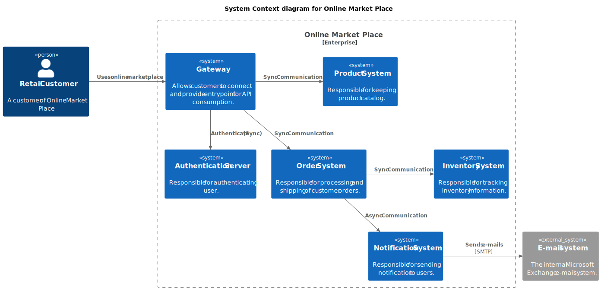

# Online Marketplace Project
The "Online Marketplace Project" is a Spring Boot-based application designed to facilitate online commerce. It employs a microservices architecture depicted in a C4 diagram, integrating the following services:

1. **Product Service**: Manages product information, including cataloging, details, and availability.

2. **Order Service**: Handles order processing, including creation, payment processing, and order status tracking.

3. **Inventory Service**: Manages inventory levels and stock availability across different products.

4. **Gateway Service**: Acts as an API gateway, routing requests from clients to appropriate microservices and handling authentication and authorization.

5. **Discovery Service**: Provides service discovery and registration, enabling dynamic routing and load balancing across microservices.

The project leverages Spring Boot for efficient and scalable development of these microservices, ensuring robustness and flexibility in handling online marketplace operations. The integration of C4 diagrams facilitates clear visualization and understanding of the system's architecture and interaction between services.

## System Diagram

## Component Diagram

## Projects Structure

Repo will have the structure of the below service

- Architecture Project [Contains C4 Diagrams]
- Product Service 
- Order Service
- Inventory Service
- Discovery Service
